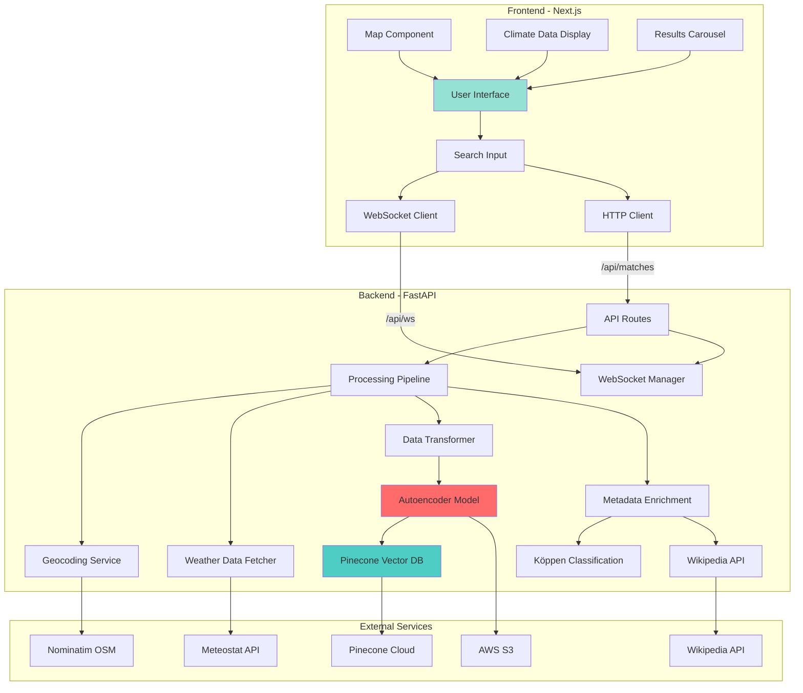
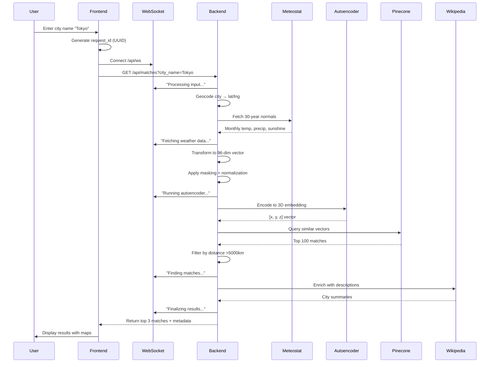
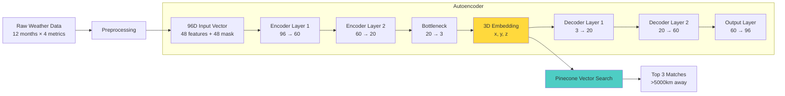
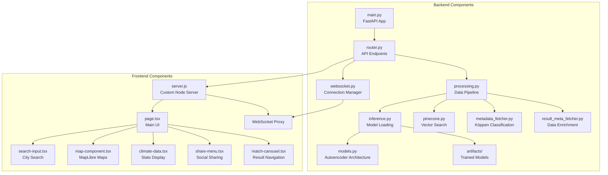

# Weather Twin

Find cities around the world with climates matching your own using machine learning and vector similarity search.

## Overview

Weather Twin is a web application that discovers cities with similar climate patterns to any searched location. Using a custom-trained autoencoder and vector similarity search, it analyzes 30 years of weather data to find the best climate matches across the globe.

**Key Features:**
- Search any city worldwide
- ML-powered climate matching using custom autoencoder
- Interactive map visualization with matched cities
- Detailed climate data comparison (temperature, precipitation, sunshine, etc.)
- Köppen climate classification
- Real-time processing updates via WebSocket
- Geographic filtering (matches must be >5000km away)

## Architecture

### System Overview



### Data Flow Pipeline



### ML Model Architecture



### Component Architecture



## Technology Stack

### Backend
- **Framework**: FastAPI + Uvicorn
- **Language**: Python 3.11
- **ML/AI**: PyTorch (autoencoder inference)
- **Data Processing**: Pandas, NumPy, scikit-learn
- **Geospatial**: Geopy (geocoding), Rasterio (Köppen raster)
- **Weather Data**: Meteostat
- **Vector Database**: Pinecone
- **Utilities**: pycountry, Rich (logging)

### Frontend
- **Framework**: Next.js 15 (React 19)
- **Language**: TypeScript
- **Styling**: Tailwind CSS + Radix UI
- **Maps**: MapLibre GL JS
- **HTTP Client**: Axios
- **WebSocket**: react-use-websocket
- **UI Components**: Shadcn/ui
- **Notifications**: Sonner (toast)

### Infrastructure
- **Containerization**: Docker + Docker Compose
- **Cloud Storage**: AWS S3 (via Railway)
- **Vector DB**: Pinecone Cloud
- **APIs**: Nominatim (OSM), Meteostat, Wikipedia

## Setup

### Prerequisites
- Docker and Docker Compose
- Node.js 18+ (for local development)
- Python 3.11+ (for local development)

### Running with Docker Compose

```bash
# Build and start both services
docker compose up --build

# Access the application
# Frontend: http://localhost:3000
# Backend API: http://localhost:8000
# API Docs: http://localhost:8000/docs
```

### Local Development

```bash
# Run development script (starts both frontend and backend)
./dev.sh

# Or run services individually:

# Backend
cd backend
uv sync
uv run uvicorn main:app --reload --port 8000

# Frontend
cd frontend
npm install
npm run dev
```

## API Documentation

### Endpoints

#### `GET /api/matches`
Find climate-similar cities.

**Parameters:**
- `city_name` (required): Name of the city to search
- `request_id` (optional): UUID for WebSocket progress tracking

**Response:**
```json
{
  "input": {
    "embeddings": [0.123, 0.456, 0.789],
    "metadata": {
      "city": "Tokyo",
      "latitude": 35.6762,
      "longitude": 139.6503,
      "koppen_code": "Cfa",
      "koppen_description": "Humid subtropical climate",
      "country": "Japan",
      "description": "Tokyo, officially the Tokyo Metropolis...",
      "temperature": { "min": 5.2, "max": 30.8 },
      "pressure": { "min": 1009.5, "max": 1019.2 },
      "precipitation": { "min": 51.0, "max": 224.9 },
      "sunshine": { "min": 149.3, "max": 213.4 },
      "wind": { "min": 2.9, "max": 4.1 }
    }
  },
  "matches": [
    {
      "embeddings": [0.124, 0.457, 0.788],
      "metadata": { /* similar structure */ },
      "score": 0.95
    }
  ]
}
```

#### `WebSocket /api/ws?request_id={uuid}`
Real-time progress updates during processing.

**Messages:**
- `"Processing input..."`
- `"Fetching weather data..."`
- `"Running autoencoder..."`
- `"Finding matches..."`
- `"Finalizing results..."`

## Project Structure

```
weather-twin/
├── backend/                      # FastAPI Python application
│   ├── cities/                   # Core business logic
│   │   ├── artifacts/            # Pre-trained models and data
│   │   │   ├── autoencoder_cities.pth  # Trained PyTorch model
│   │   │   ├── my_minmax_scaler.pkl    # Data normalization
│   │   │   ├── koppen.tif              # Climate classification raster
│   │   │   └── file.csv                # City database
│   │   ├── models.py             # Autoencoder neural network
│   │   ├── inference.py          # Model inference pipeline
│   │   ├── processing.py         # Data pipeline (6 steps)
│   │   ├── pinecone.py           # Vector database integration
│   │   ├── metadata_fetcher.py   # Köppen classification
│   │   ├── result_meta_fetcher.py # Data enrichment
│   │   ├── router.py             # API routes
│   │   ├── websocket.py          # WebSocket manager
│   │   ├── schemas.py            # Pydantic models
│   │   └── util.py               # Utilities (distance calc)
│   ├── main.py                   # FastAPI app initialization
│   ├── pyproject.toml            # Dependencies
│   └── Dockerfile                # Container config
│
├── frontend/                     # Next.js React application
│   ├── src/
│   │   ├── app/
│   │   │   ├── page.tsx          # Main UI
│   │   │   ├── layout.tsx        # Root layout
│   │   │   └── api/matches/route.ts  # Backend proxy
│   │   ├── components/
│   │   │   ├── ui/               # Shadcn/radix primitives
│   │   │   └── weather/          # Weather-specific components
│   │   └── lib/
│   │       ├── types.ts          # TypeScript interfaces
│   │       └── utils.ts          # Köppen similarity
│   ├── server.js                 # Custom Node server + WebSocket
│   ├── next.config.ts
│   └── Dockerfile
│
├── compose.yaml                  # Docker Compose
├── dev.sh                        # Development script
└── README.md
```

## How It Works

### 1. Data Collection
When a user searches for a city, the system:
- Geocodes the city name to latitude/longitude using Nominatim (OpenStreetMap)
- Fetches 30-year weather normals (1991-2020) from Meteostat
- Collects monthly averages for: min/max temperature, precipitation, sunshine

### 2. Data Processing
The raw weather data undergoes transformation:
- **Extraction**: 4 key metrics × 12 months = 48 features
- **Masking**: Create 48-bit mask for missing values (handles incomplete data)
- **Normalization**: Apply pre-trained MinMaxScaler to normalize to [0,1] range
- **Result**: 96-dimensional vector (48 features + 48 mask bits)

### 3. ML Embedding Generation
The 96D vector passes through a trained autoencoder:
- **Architecture**: 96 → 60 → 20 → 3 (encoder) | 3 → 20 → 60 → 96 (decoder)
- **Training**: Trained on global weather normals dataset
- **Output**: 3D embedding vector representing climate characteristics
- **Benefit**: Reduces dimensionality for efficient similarity search

### 4. Vector Similarity Search
Using the 3D embedding:
- Query Pinecone vector database with cosine similarity
- Retrieve top 100 most similar cities
- **Geographic filtering**: Remove cities within 5000km (great-circle distance)
- Return top 3 matches ranked by similarity score

### 5. Metadata Enrichment
For the input city and all matches:
- **Köppen Classification**: Look up climate type using raster file (30 classes)
- **Country**: Reverse geocode to get country name
- **Statistics**: Calculate min/max ranges for all weather metrics
- **Description**: Fetch Wikipedia summary for context
- **Köppen Similarity**: Client-side calculation comparing climate classes

### 6. Results Display
The frontend presents:
- Interactive maps showing input and matched cities
- Side-by-side climate data comparison
- Köppen climate classification badges
- Similarity scores (vector + Köppen)
- Social sharing options

## Köppen Climate Classification

The system uses the Köppen-Geiger climate classification with 30 distinct types:

| Code | Climate Type | Example Cities |
|------|--------------|----------------|
| Af | Tropical rainforest | Singapore, Manaus |
| Am | Tropical monsoon | Mumbai, Dhaka |
| Aw | Tropical savanna | Havana, Lagos |
| BWh | Hot desert | Dubai, Phoenix |
| BWk | Cold desert | Almaty, Kabul |
| BSh | Hot semi-arid | Niamey, Karachi |
| BSk | Cold semi-arid | Denver, Madrid |
| Csa | Mediterranean hot summer | Athens, Los Angeles |
| Csb | Mediterranean warm summer | San Francisco, Lisbon |
| Csc | Mediterranean cool summer | Punta Arenas |
| Cwa | Humid subtropical, dry winter | Hong Kong, Mexico City |
| Cwb | Subtropical highland | Nairobi, Bogotá |
| Cwc | Cold subtropical highland | Lhasa |
| Cfa | Humid subtropical | Tokyo, New York |
| Cfb | Oceanic | London, Paris |
| Cfc | Subpolar oceanic | Reykjavík |
| Dsa | Mediterranean-influenced hot summer | Ankara |
| Dsb | Mediterranean-influenced warm summer | Salt Lake City |
| Dsc | Mediterranean-influenced cool summer | Yellowknife |
| Dwa | Humid continental, dry winter | Beijing, Seoul |
| Dwb | Warm summer humid continental, dry winter | Ulaanbaatar |
| Dwc | Subarctic, dry winter | Yakutsk |
| Dwd | Extremely cold subarctic, dry winter | Verkhoyansk |
| Dfa | Hot summer humid continental | Chicago, Moscow |
| Dfb | Warm summer humid continental | Montreal, Stockholm |
| Dfc | Subarctic | Anchorage, Irkutsk |
| Dfd | Extremely cold subarctic | Oymyakon |
| ET | Tundra | Barrow, Longyearbyen |
| EF | Ice cap | Antarctica, Greenland |

## Notable Design Decisions

### Why 3D Embeddings?
- **Efficiency**: Pinecone vector search is optimized for low-dimensional spaces
- **Visualization**: Could theoretically plot all cities in 3D space
- **Compression**: Reduces 96D → 3D while preserving climate similarity patterns

### Why Geographic Filtering?
Ensures "climate twins" are truly interesting discoveries, not just neighboring cities. A 5000km threshold guarantees matches are on different continents or far regions.

### Why WebSocket Progress?
The ML inference and data enrichment can take 5-15 seconds. Real-time updates improve UX by showing users the system is actively processing their request.

### Why Custom Node Server?
Next.js standalone mode doesn't natively support WebSocket proxying. The custom `server.js` handles both Next.js rendering and WebSocket forwarding to the backend.

### Why Köppen Classification?
Provides interpretable climate categorization alongside ML embeddings. Users can understand matches both quantitatively (similarity score) and qualitatively (climate type).

## Development

### Running Tests
```bash
# Backend tests
cd backend
uv run pytest

# Frontend tests
cd frontend
npm test
```

### Building for Production
```bash
# Build both services
docker compose build

# Or build individually
cd backend && docker build -t weather-twin-backend .
cd frontend && docker build -t weather-twin-frontend .
```

### Model Retraining
The autoencoder is pre-trained. To retrain:
1. Prepare new weather normals dataset
2. Update training script (not included in repo)
3. Save new `.pth` and `.pkl` files to `backend/cities/artifacts/`
4. Regenerate Pinecone embeddings for all cities

## Acknowledgments

- **Meteostat**: Historical weather data
- **Pinecone**: Vector similarity search infrastructure
- **OpenStreetMap**: Geocoding services
- **Wikipedia**: City descriptions
- **Köppen Climate Classification**: Dr. Wladimir Köppen and Rudolf Geiger

---

**Built using ML, geospatial data, and modern web technologies.**
